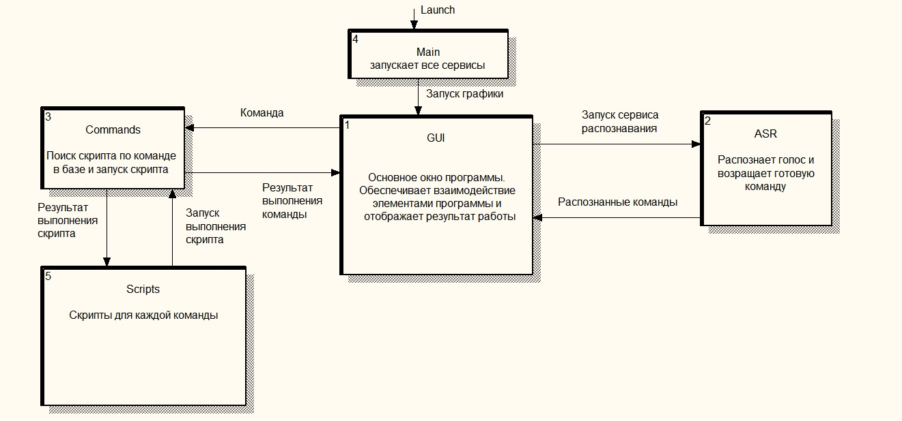

# Voice_helper

# Программное продукт представляет собой решения кейса "Голосовой помощник" в рамках онлайн хакатона HackAtom

## Описание

Разработка программного продукта (голосового помощника),способного распознавать голосовые команды–голосовые поисковые запросы,способного интерпретировать эти запросы и перенаправлять эти запросы для выполнения поисковых операций в разнородных источниках информации. Которые, в совокупности,образуют корпоративную базу знаний.К примерам разнородных источников можно отнести корпоративное файловое хранилище, корпоративные интернет-ресурсы, архив почтовых сообщений и т.д.

## Сценарий испльзования продукта
Осуществлять голосовое взаимодействие с пользователем с целью получения поисковых запросов к корпоративной базе знаний,а также с целью навигации по результатам поиска.

## Техническая реализация продукта
### Схема работы продукта

### Текстовое описание решения
1) `main.py` выполняет запуск главного компанента, Рабочего окна (`GUI.py`), которое обеспечивает взаимосвязную работу всех компонентов.
2) Файл `ASR.py` главный файл для обеспечивания работы распознавания речи и передачи команд специальному модулю.
3) Файл `command.py` выполняет поиск команд и обеспечивает из запуск.
4) Файл `scripts.py` хранит в себе набор скриптов для выполнения команд и возращает результат работы в `command.py`, который в свою очередь передает результат в `GUI.py` и выводит результат работы на экран.

## Сборка и запуск

## Установка зависимостей python
`pip install -r requirements.txt`

Так как нам необходимо слушать микрофон, необходимо установить модуль PyAudio.  
В оффицаильных репозиториях для Windows его нет, поэтому необходимо скачать неофициальную сборку по ссылке  
`https://www.lfd.uci.edu/~gohlke/pythonlibs/#pyaudio`  
После загрузки делаем  
`pip install <название_скачанного_пакета>`

### Часть серверная (SOVA ASR)
- https://github.com/sovaai/sova-asr

### Часть клиенская
Требования:
- Python 3.8.6 (64 bit)
- Windows 10  

Запуск производится запуском файла `main.py` из директории `Backend`  
Команда будет выглядеть так  
`python Backend/main.py`